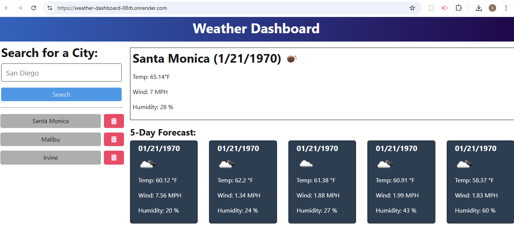

# Weather Dashboard


## Overview
Weahter dashbord provides a real-time, location based weather information offering users to quickly check current weather conditions, forcast for the city and that city is added to the search history.

## Functionality
API Used : [5 Days Weather Forcast](https://openweathermap.org/forecast5)

City Search : When a user enters city name in search, the dashboard displays the current weather and forcast for next 5 days. Additionaly the city is added to search history for future access.  

Weather Details: Upon selecting the the city or performing a search user is presented with key weather information
 1. City Name
 2. Date
 3. An Icon representation of weather conditions 
 4. Temperature 
 5. Humidity and wind speed

Manage Search History: User can view past city or he can remove city from search history.

## Installation

- Clone a repository 
  ```sh
      git clone git@github.com:sheetalmangate/CICD_Pipeline_Demo.git
  ```

- Navigate to your project directory and run the command below, which will install all required dependencies. 
  ```sh
      npm install
  ```

- To run the README-Generator use the command below in the command prompt
```
    npm run start
```
## Mock up

  

## Contributing
Contributions and PR's are welcome.

- Feel free to check [issues page](https://github.com/sheetalmangate/weather_dashboard/issues) if you want to contribute.
- Open a Pull Request 
    <p>Navigate to the original repository and click on "New Pull Request". Describe your changes and submit the pull request.</p>

## Questions
  For any question please reach out!

  - **Email** : [sheetal.mangate@gmail.com](sheetal.mangate@gmail.com)
  - **GitHub** : [sheetal](https://github.com/sheetalmangate) 

Thank you for your interest and feedback! 

